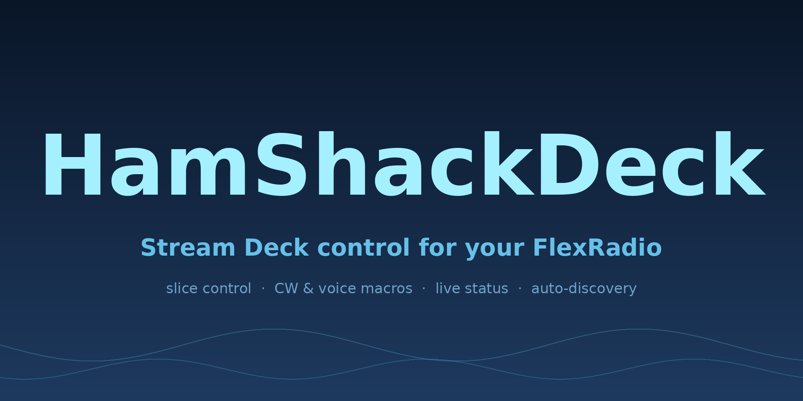
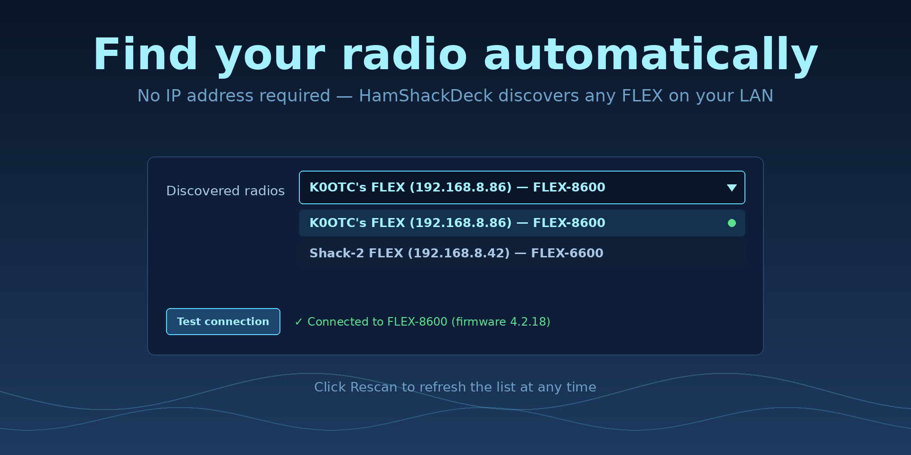
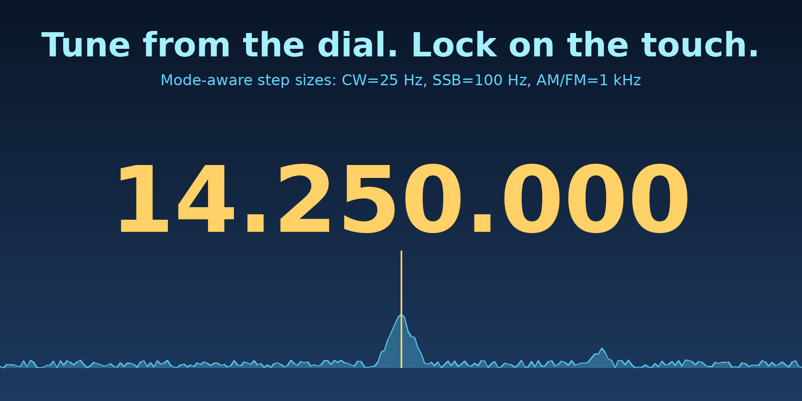
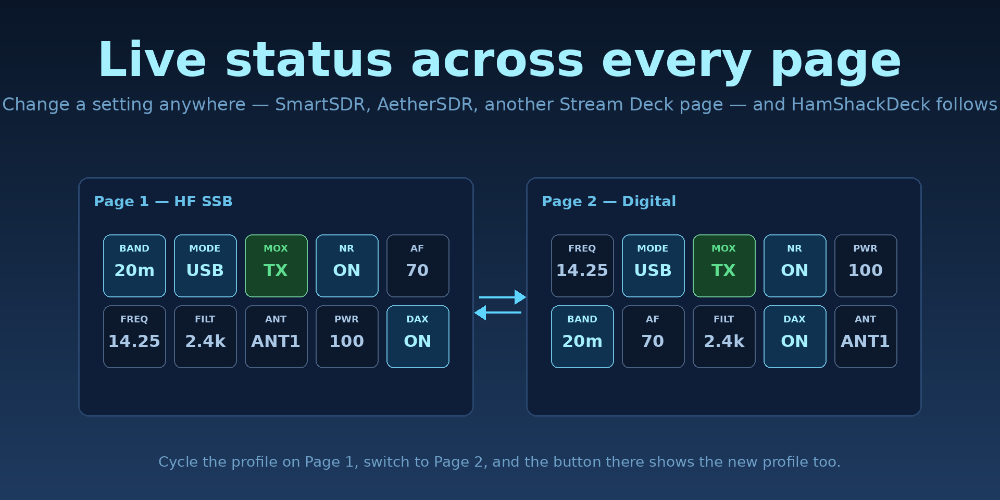
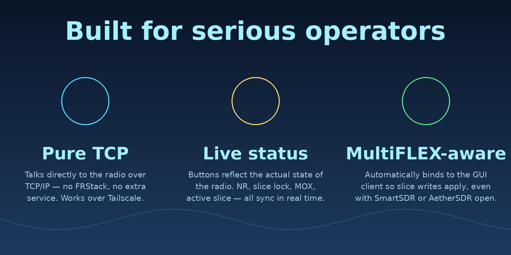
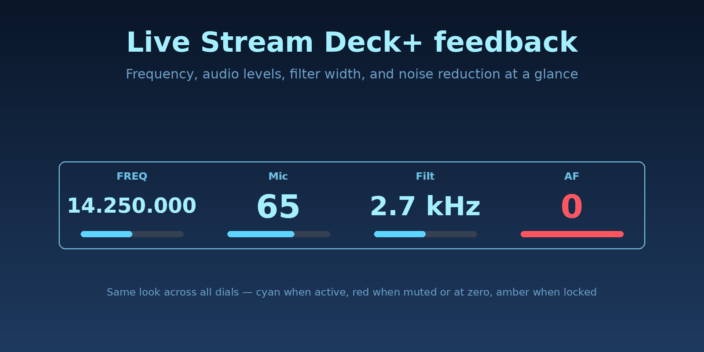
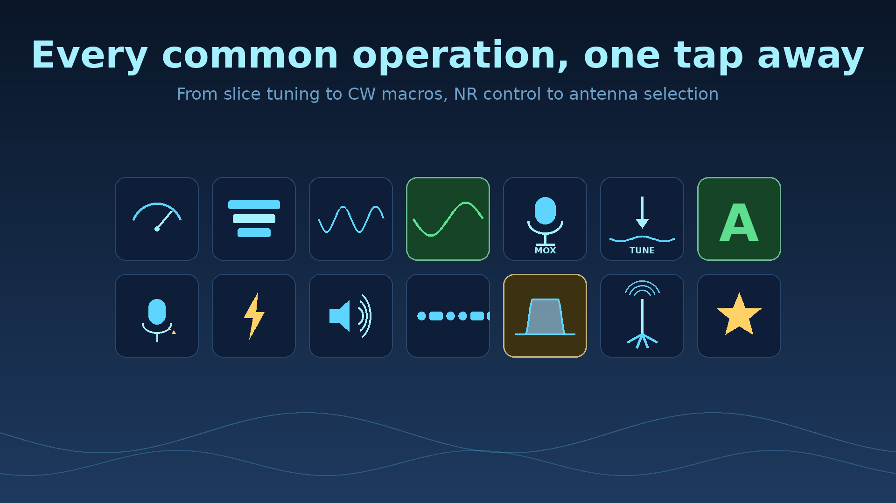
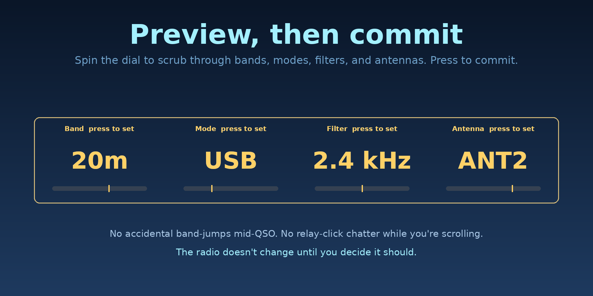

# HamShackDeck

<p align="center">
  
</p>

**HamShackDeck** is a Stream Deck plugin that controls FlexRadio FLEX 6000
and 8000 series transceivers directly over the SmartSDR TCP/IP API. No
FlexLib, no separate SmartSDR process required on the same machine — the
plugin opens one shared TCP connection per radio host (port 4992) and
reuses it across every key and dial. Plays nicely with SmartSDR and
AetherSDR connected at the same time (MultiFLEX).

Works on **Stream Deck**, **Stream Deck XL**, and **Stream Deck+** (with
full dial and LCD strip support for level and tune controls).

<p align="center">
  
</p>

> Previously released as **FlexDeck**; renamed at FlexRadio's request.
> "FlexRadio", "SmartSDR", and the FLEX-6400 / 6500 / 6600 / 6700 / 8400 /
> 8600 model names are trademarks of FlexRadio Systems. HamShackDeck is an
> independent third-party plugin and is not affiliated with or endorsed by
> FlexRadio.

## Supported radios

FLEX-6400, 6500, 6600, 6700, 8400, 8600, and other 6000/8000-series radios
running SmartSDR firmware that exposes the standard TCP/IP API on port
4992. Tested on a FLEX-8600 with SmartSDR 4.2.18 on Windows 11.

## Actions (32 total)

<p align="center">
  
</p>

### Tuning & operating

| Action | Type | What it does |
|---|---|---|
| **Frequency** | key | Tune a slice to a specific MHz (and optionally set mode). |
| **Frequency Dial** | key + **dial** | Rotate to tune in step-size increments; press for preset. |
| **Band** | key + **dial** | Jump the active slice 160m–6m; rotate to step through bands. |
| **Mode** | key + **dial** | Set demod mode: USB, LSB, CW, DIGU, DIGL, AM, FM, ... |
| **Filter** | key + **dial** | Adjust slice filter width. |
| **Antenna** | key + **dial** | Select RX/TX antenna port. |
| **RIT** | key + **dial** | Receiver incremental tuning. |
| **XIT** | key + **dial** | Transmitter incremental tuning. |
| **Memory Recall** | key | Apply a stored memory channel by index. |

### Audio & DSP

| Action | Type | What it does |
|---|---|---|
| **AF Volume** | key + **dial** | Slice audio level. Rotate to adjust, press to mute. |
| **AF Mute** | key | Toggle slice RX audio mute with one press. Reflects radio state in real time. |
| **AGC Threshold** | key + **dial** | AGC-T. Rotate to adjust, press to cycle off/fast/med/slow. |
| **Sidetone** | key + **dial** | CW monitor gain. Rotate to adjust, press to toggle monitor. |
| **Headphone** | key + **dial** | Front-panel headphone gain. Rotate to adjust, press to mute. |
| **System Volume** | key + **dial** | Master system audio. |
| **Mic Gain** | key + **dial** | Microphone gain. |
| **Noise Reduction** | key + **dial** | Toggle, set, or **cycle** NR / NB / ANF / NRF / NRL / NRS / RNN. |

### Transmit

| Action | Type | What it does |
|---|---|---|
| **TX / MOX** | key | Manual key/unkey (MOX). |
| **TUNE** | key | Toggle tune carrier. |
| **RF Power** | key + **dial** | Adjust TX RF power. |
| **Tune Power** | key + **dial** | Adjust tune carrier power. |
| **DAX TX** | key + **dial** | Toggle TX DAX routing / adjust TX DAX gain. |
| **CW Speed** | key + **dial** | Set CW WPM. |
| **ON AIR Indicator** | key (read-only) | Lights up red whenever the radio transmits, regardless of source. |

### Profiles & macros

| Action | Type | What it does |
|---|---|---|
| **Profile** | key | Load a global / mic / TX profile by name. |
| **Profile Cycle** | key | Cycle through a list of profile names. |
| **Voice Macro** | key | Play a WAV through DAX TX, or trigger the radio's quick-record buffer. |
| **CW Macro** | key | Send a CW message via CWX with `{call}` substitution and per-button WPM. |
| **Smart Macro** | key | Higher-level macro with conditionals. |
| **Macro** | key | Run an arbitrary list of SmartSDR API commands. |
| **Raw Command** | key | Send a single raw API command for debugging. |

### Metering

| Action | Type | What it does |
|---|---|---|
| **Meter** | key + **dial** | Display S-meter, SWR, power, ALC, etc. on the key or LCD. |

## Per-slice control

Every slice-aware action uses a consistent **A / B / C / D dropdown** in
its Property Inspector (mapping to slice indices 0–3). All 15 slice-aware
actions use the same picker — no more textbox-vs-dropdown mix.

<p align="center">
  
</p>

## Stream Deck+ dials

Actions with both **Keypad** and **Encoder** controllers can be placed on
either a key or a dial. On a dial:

- **Rotate** — adjusts within `[min, max]` by `step` per tick. Writes to
  the radio are debounced (~30ms) so a fast spin doesn't flood the TCP
  bus; the LCD updates immediately for a snappy feel.
- **Press** — context-sensitive: mute on AF/headphone/system volume, AGC
  mode cycle on AGC, CW monitor toggle on sidetone, etc.
- **LCD strip** — custom layouts show label, value, and a bar indicator
  on a HamShackDeck-branded background.

On a regular key, pressing sets the value to a configurable preset.

<p align="center">
  
</p>

<p align="center">
  
</p>

<p align="center">
  
</p>

## ON AIR Indicator

A read-only status display that lights up red whenever the radio is on the
air, regardless of what caused the transmit (DVK, MOX button, CW iambic,
foot switch, RCA PTT, an API command from another app). The key press is
intentionally a no-op so it can't accidentally key the radio.

## CW macros

Sends via SmartSDR's `cwx send` command (the radio's built-in keyer).
Spaces are auto-encoded to `0x7F` per the API spec. Each button can:

- Have its own **WPM** override (`cwx wpm`)
- Set a **break-in delay** (`cwx delay`)
- Use **`{call}` substitution** so you store your callsign once globally
- Optionally **force CW mode** on the active slice before sending

Common templates:

```
CQ CQ CQ DE {call} {call} K
{call} TU 73 EE
R R UR 599 599 BK
```

## Voice macros

Two playback routes:

**DAX TX (most common)** — route your computer's audio output to
"DAX RESERVED AUDIO TX 1" (Windows: Listen tab on the recording device;
macOS: Loopback or BlackHole; etc.). HamShackDeck enables TX DAX, keys
MOX, plays the WAV via the OS audio engine (`afplay` on macOS, PowerShell
`SoundPlayer` on Windows, `aplay` on Linux), then unkeys and disables DAX.
Errors are caught in a `finally` so the radio always unkeys.

**Quick-record** — triggers the radio's internal `playback start` for
buffers recorded with the front-panel quick-record button. No file needed.

## Profiles

Three flavors, loaded by name with auto-quoting (so spaces are fine):

| Kind | API command | Use for |
|---|---|---|
| `global` | `profile global load "<name>"` | Full radio state snapshot |
| `mic` | `profile mic load "<name>"` | Mic gain, EQ, processor, DEXP, VOX, DAX |
| `tx` | `profile tx load "<name>"` | Power level, tune power, transmit delays |

## Noise reduction — three behaviors

- **Toggle one feature** — button keeps its own on/off state and flips it.
- **Set one feature on/off** — useful for dedicated "NRF on" / "NRF off" keys.
- **Cycle through states** — comma-separated list, each press advances.
  Each entry is `off` or features joined with `+`, e.g.
  `off,nr,nrf,nr+nrf` or `off,nrs` (AI denoise on/off).

When an entry is applied, every NR feature is explicitly written so the
radio reflects the entry exactly with no leftover flags.

## Install

Download the latest `hamshackdeck-vXX.X.X.zip` from
[Releases](https://github.com/k0otc/hamshackdeck/releases), unzip to get
`com.k0otc.hamshackdeck.streamDeckPlugin`, and double-click it. Stream
Deck will install and prompt to launch.

Requires **Stream Deck 7.1 or later**. Windows is fully supported; macOS
support is on the roadmap.

### Upgrading from FlexDeck

HamShackDeck installs alongside FlexDeck under a new plugin UUID. After
verifying your new buttons work, uninstall the old FlexDeck plugin from
Stream Deck's plugin manager. See `MIGRATION.md` for the full playbook.

## Configure a button

Each button has a Property Inspector with at minimum a **Radio host/IP**
field (the radio's LAN IP, e.g. `192.168.1.50`). Slice (A/B/C/D) defaults
to **A**. Frequencies are in MHz with `.` decimal separator.

<p align="center">
  
</p>

## Macro examples

```
# 20m FT8 with NR + NRF
slice tune 0 14.074
slice set 0 mode=DIGU
slice set 0 nr=1
slice set 0 nrf=1
```

```
# CW contest setup
profile global load "CW Contest"
slice tune 0 14.030
slice set 0 mode=CW
transmit set mon_gain_cw=20
cw mon=1
```

## SmartSDR commands used

| Feature | Command |
|---|---|
| Tune slice | `slice tune <n> <MHz>` |
| Set mode | `slice set <n> mode=<mode>` |
| Slice volume | `audio client 0 slice <n> gain <0-100>` |
| Slice mute | `audio client 0 slice <n> mute <0\|1>` |
| AGC mode | `slice set <n> agc_mode=<off\|fast\|med\|slow>` |
| AGC threshold | `slice set <n> agc_threshold=<0-100>` |
| Filter | `filt <n> <low> <high>` |
| Antenna | `slice set <n> rxant=<port> txant=<port>` |
| RIT / XIT | `slice set <n> rit_on=<0\|1> rit_freq=<Hz>` (and `xit_*`) |
| Sidetone gain | `transmit set mon_gain_cw=<0-100>` |
| CW monitor | `cw mon=<0\|1>` |
| Headphone gain | `mixer headphone gain <0-100>` |
| Headphone mute | `mixer headphone mute <0\|1>` |
| Load profile | `profile <global\|mic\|tx> load "<name>"` |
| Recall memory | `memory apply <n>` |
| NR features | `slice set <n> <nr\|nb\|anf\|nrf\|nrl\|nrs\|rnn>=<0\|1>` |
| MOX | `xmit <0\|1>` |
| TUNE | `transmit tune <on\|off>` |
| RF / Tune power | `transmit set rfpower=<n>` / `tunepower=<n>` |
| TX DAX | `transmit set dax=<0\|1>` |
| CW send | `cwx send <text>` (spaces as `0x7F`) |
| CW WPM | `cwx wpm <n>` |
| CW delay | `cwx delay <ms>` |
| Quick playback | `playback start` |
| Subscribe | `sub <slice\|interlock\|meter\|profiles\|client> all` |

## Project layout

```
hamshackdeck/
├── com.k0otc.hamshackdeck.sdPlugin/
│   ├── manifest.json
│   ├── bin/plugin.js          ← bundled output
│   ├── imgs/
│   │   ├── actions/           ← per-action icon sets
│   │   └── plugin/            ← marketplace, category, touchscreen bg
│   ├── layouts/               ← Stream Deck+ LCD layouts
│   └── ui/                    ← Property Inspector HTMLs
├── src/
│   ├── plugin.ts              ← entry point
│   ├── flex/                  ← protocol layer
│   │   ├── FlexClient.ts      ← TCP protocol client
│   │   ├── pool.ts            ← shared connection per host
│   │   ├── status.ts          ← status subscription dispatch
│   │   ├── meters.ts          ← meter stream
│   │   ├── bands.ts           ← band plan, mode list, NR keys
│   │   ├── discovery.ts       ← VITA-49 UDP discovery
│   │   ├── probe.ts           ← capability probe
│   │   └── LevelControl.ts    ← shared base for key+dial level actions
│   └── actions/               ← 31 action implementations
├── package.json
├── rollup.config.mjs
└── tsconfig.json
```

## Build from source

Requires Node.js 24+ and Stream Deck 7.1+.

```bash
npm install -g @elgato/cli
npm install
streamdeck link com.k0otc.hamshackdeck.sdPlugin
npm run watch
```

The plugin appears in the Stream Deck app under "HamShackDeck".

## Roadmap

Shipped: status subscriptions (slice / interlock / meter / profiles), ON
AIR indicator, frequency dial, TUNE / MOX, slice select via A/B/C/D
dropdown, meter readout.

Considering for future releases:

- Squelch
- EQ presets
- Panadapter zoom
- macOS support
- Hamlib backend
- Stream Deck marketplace submission

## Changelog

See [CHANGELOG.md](CHANGELOG.md).

## License

MIT.

## Author

Maintained by **K0OTC**.
